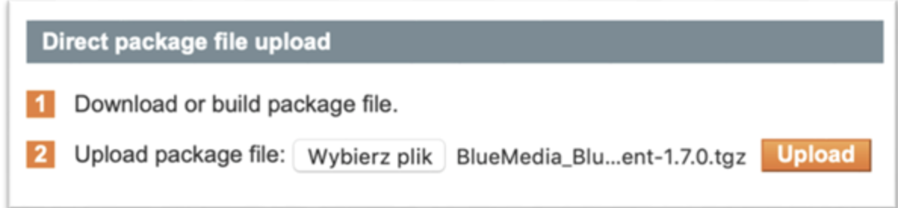
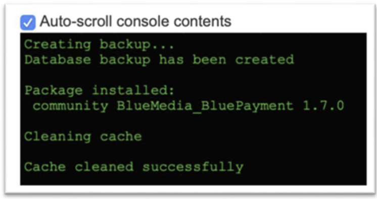
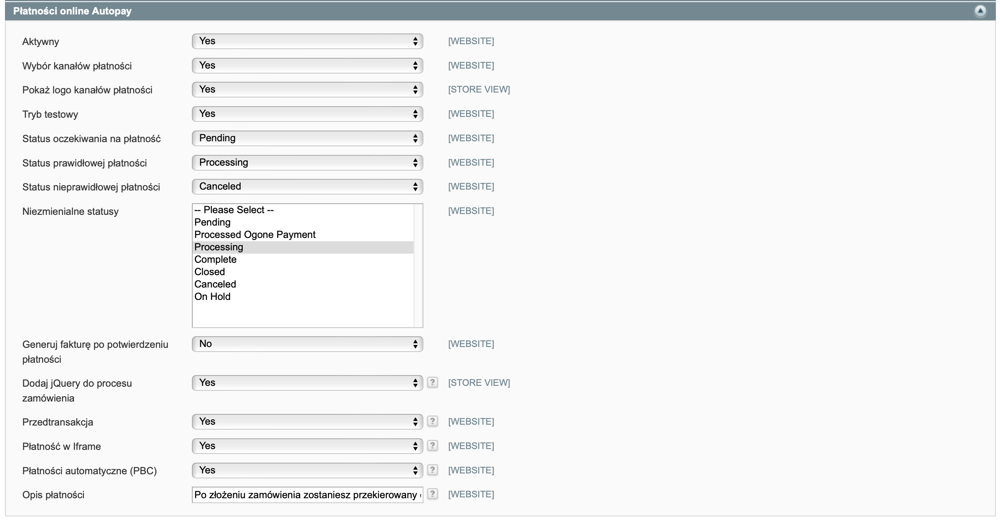
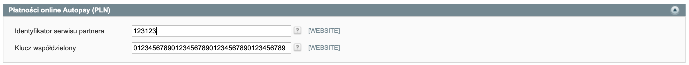

# Instrukcja modułu „Autopay” dla platformy Magento

## Podstawowe informacje
Moduł płatności umożliwiający realizację transakcji bezgotówkowych w sklepie Magento. UWAGA! Od czerwca 2020 r. firma Adobe nie wspiera już Magento 1.0, co znaczy, że nie są publikowane aktualizacje oraz poprawki dotyczące bezpieczeństwa. Rekomendujemy aktualizację platformy sprzedażowej do wersji 2.0. Wtyczkę Magento 2.0 możesz pobrać [tutaj.](https://github.com/bluepayment-plugin/magento-2.x-plugin/archive/refs/heads/master.zip)

### Główne funkcje
Do najważniejszych funkcji modułu zalicza się:
-	obsługę wielu sklepów jednocześnie z użyciem jednego modułu
-	obsługę zakupów bez rejestracji w serwisie
-	obsługę dwóch trybów działania – testowego i produkcyjnego (dla każdego z nich wymagane są osobne dane kont, o które zwróć się do nas)

### Wymagania
-	Wersja Magento: 1.6.0 – 1.9.0.
-	Wersja PHP zgodna z wymaganiami względem danej wersji sklepu.

## Instalacja
💡 Jeżeli korzystasz z Magento w wersji niższej niż 1.7 – skorzystaj z metody ręcznej instalacji, ponieważ instalacja modułu za pomocą pliku .tgz nie jest obsługiwana.

### Instalacja z użyciem pliku .tgz

1.. Zacznij od [pobrania](https://github.com/bluepayment-plugin/magento-1.x-plugin/archive/refs/heads/master.zip) najnowszej wersji modułu Autopay dla platformy Magento.
2. Następnie zaloguj się do panelu administracyjnego Magento. 
3. Wybierz z głównego menu **System ➝ Magento Connect ➝ Zarządzanie Magento Connect [Magento Connect Manager]**, a otworzy się nowe okno do administracji modułów Magento.

💡 Zalecamy:
- zaznaczyć opcję Put store on the maintenance mode while installing/upgrading/backup creation;
- utworzyć kopię zapasową, zaznaczając opcję Create Backup.

4. W sekcji Direct package file upload, w punkcie 2. Upload package file, wybierz uprzednio pobrany plik .tgz z modułem Autopay i kliknij Upload.

5. Zobaczysz wtedy sekcję z rezultatem instalacji. Komunikat Package Installed oznacza, że instalacja modułu przebiegła prawidłowo i możesz przejść dalej – do konfiguracji płatności. W przypadku niepowodzenia – zainstaluj moduł ręcznie.

### Ręczna instalacja

1. Zacznij od [pobrania](https://github.com/bluepayment-plugin/magento-1.x-plugin/archive/refs/heads/master.zip) najnowszej wersji modułu BluePayment dla platformy Magento.
2. Następnie wgraj plik .tar do katalogu głównego Magento.
3. Będąc w katalogu główny, wykonaj komendę: tar zxvf BlueMedia_BluePayment-*.tgz --exclude package.xml && rm BlueMedia_BluePayment-*.tgz
4. Zaloguj się do panelu administracyjnego Magento i wybierz z głównego menu **System ➝ Zarządzanie cache [Cache Management]**.
5. Kliknij na **Opróżnij składowanie cache Magento [Flush Magento Cache]**.

Po wykonaniu tego kroku wtyczka jesy gotowa do użycia i możesz przejść do jej konfiguracji.

## Konfiguracja
1. Zaloguj się do panelu administracyjnego Magento i wybierz z menu głównego **System ➝ Konfiguracja [Configuration]**. 
2. Następnie, w menu po lewej stronie, wybierz **Sprzedaże [Sales] ➝ Metody płatności [Payment Methods]**.

### Podstawowa konfiguracja modułu
1. Przejdź do strony **Konfiguracja modułu**.
2. Wejdź w zakładkę **Płatności Online BM [Online payment BM]** i wypełnij obowiązkowe pola:
-	**Moduł aktywny [Enabled]**
-	**Tryb testowy [Test mode]**

3. Dla obsługiwanych walut – wypełnij widoczne poniżej pola danymi, które od nas otrzymasz:
-	**Identyfikator serwisu Partnera [Service Partner ID]**
-	**Klucz współdzielony [Shared Key]**

### Wyświetlanie kanałów płatności w serwisie

Moduł Autopay umożliwia klientowi wybór kanału płatności bezpośrednio na stronie sklepu – bez przekierowywania na stronie Autopay. Żeby aktywować tę funkcję, wykonaj następujące kroki:
1.	Przejdź do strony konfiguracji modułu.
2.	Otwórz zakładkę **Płatności online BM (Online payment BM]** i przy Wyborze kanałów płatności **[Gateway Selection]** zaznacz **Tak [Yes]**.
3.	Jeżeli chcesz, żeby przy kanale płatności było widoczne logo, zaznacz **Tak [Yes]** przy funkcji **Pokaż logo kanałów płatności [Show Gateway Logo]**.

### Przedtransakcja
Usługa przedtransakcji może być użyteczna do:
-	zweryfikowania poprawności parametrów linku płatności, zanim klient zostanie przekierowany na bramkę płatniczą – wywołanie linka powoduje walidację wszystkich parametrów;
-	skrócenia linku płatności – zamiast kilku/kilkunastu parametrów, link zostaje skrócony do dwóch identyfikatorów;
-	ukrycia danych wrażliwych parametrów linku transakcji – sama przedtransakcja następuje w tle, a link do kontynuacji transakcji nie zawiera danych wrażliwych, a jedynie identyfikatory potrzebne do powrotu do transakcji.

### Aktywacja
1.	Żeby aktywować przedtransakcję, przejdź na stronę konfiguracji modułu.
2.	W zakładce **Płatności online BM [Online Payment BM]** zaznacz **Tak [Yes]** przy funkcji **Przedtransakcja [Curl Payment]**.

### Kanały płatności

💡 Żeby skonfigurować kanały płatności, zaloguj się do panelu administracyjnego i wybierz z menu głównego Autopay ➝ Manage Gateways.
Odświeżenie listy kanałów płatności

1.	Wybierz z menu głównego **Autopay ➝ Manage Gateways**.
2.	Następnie kliknij **Sync Gateways** po prawej stronie ekranu.

### Aktywacja i edycja kanału płatności
1.	Wybierz z menu głównego **Autopay ➝ Manage Gateways**.
2.	Następnie kliknij na wiersz kanału, który chcesz aktywować.
3.	Zmień **Status kanału (Gateway Status]** na **Aktywny [Enabled]**.

Pozostałe opcje dostępne w zakładce kanału to:
-	Identyfikator kanału [Gateway ID]
-	Waluta [Currency]
-	Nazwa banku [Bank Name]
-	Nazwa [Gateway Name] – domyślna nazwa kanału płatności
-	Własna nazwa [Own Name] – umożliwia zmianę nazwy wyświetlanej przy kanale

-	Typ [Gateway Type]
-	Opis [Gateway Description] – opis kanału płatności niewidoczny dla użytkownika
-	Traktuj jako osobną metodę płatności [Is separated method?] – powoduje wyświetlanie danego kanału jako osobnej metody płatności na stronie

- Kolejność [Sort Order] – kolejność sortowania kanałów na liście, gdzie 1 oznacza pierwszą pozycję na liście, 2 drugą, (...), a 0 ostatnią
- URL do logo [Gateway Logo URL] – adres do logo kanału
- Użyj własnego logo [Use Own Logo] – umożliwia dodanie własnego logo do kanału (w formacie .jpg, .png, .gif)
- Data ostatniej aktualizacji [Status Date] – data i godzina ostatniej aktualizacji danych dotyczących kanału

### Płatność w iframe
To funkcja, która umożliwia klientom dokonanie płatności kartą płatniczą bez wychodzenia ze sklepu i opuszczania procesu zakupowego. Implementacja takiej formy płatności ze względu na wymogi związane z bezpieczeństwem procesowania transakcji wymaga dwóch dodatkowych dokumentów: SAQ oraz audytu strony.

#### Aktywacja

1.	Żeby aktywować płatności iframe przejdź do strony konfiguracji modułu.
2.	Wejdź do zakładki **Płatności Online BM [Online payment BM]** i zaznacz **Tak [Yes]** przy funkcji **Płatność w Iframe [Iframe payment]**.

### Płatności automatyczne
Funkcja Płatności jednym kliknięciem [One-Click Payment] to kolejny sposób na wygodne płatności z wykorzystaniem kart płatniczych. Pozwala na realizowanie szybkich płatności, bez konieczności każdorazowego podawania przez klienta wszystkich danych uwierzytelniających kartę. 

Proces obsługi płatności polega na jednorazowej autoryzacji płatności kartą i przypisaniu danych karty do konkretnego klienta. Pierwsza transakcja zabezpieczona jest protokołem 3D-Secure, natomiast kolejne realizowane są na podstawie przesłanego przez partnera żądania obciążenia karty. Płatność automatyczna dostępna jest tylko dla zalogowanych klientów sklepu.

#### Aktywacja

1.	Żeby aktywować płatności automatyczne przejdź do strony konfiguracji modułu.
2.	Wejdź do zakładki **Płatności Online BM [Online payment BM]** i zaznacz **Tak [Yes]** przy funkcji **Płatności automatyczne [Automatic payment]**.

### Zarządzanie kartami

Moduł płatności Autopay umożliwia zapamiętanie karty i powiązanie jej z kontem klienta przy pierwszej poprawnie zrealizowanej płatności z wykorzystaniem płatności automatycznej oraz zaakceptowaniu regulaminu.

Klient sklepu ma zawsze możliwość usunięcia zapamiętanej karty bezpośrednio z poziomu swojego konta. Żeby to zrobić musi:
1.	zalogować się do sklepu internetowego,
2.	przejść do **ACCOUNT ➝ Moje konto [My account]**,
3.	wybrać **Zapisane karty [Saved cards]** z menu po lewej stronie (wyświetli się wówczas lista zapisanych kart),

4.	wybrać kartę, którą chce usunąć i kliknąć **Usuń [Delete]**.

### Aktualizacja

💡 Podczas aktualizacji modułu skorzystaj z tej samej metody, którą wybrałeś podczas instalacji. Jeśli wcześniej użyłeś pliku .tzg, teraz zrób to samo, a jeśli wybrałeś instalację ręczną, aktualizację również przeprowadź ręcznie.

#### Aktualizacja z użyciem pliku .tgz

Żeby zaktualizować moduł:
1.	usuń poprzednią wersję modułu postępując zgodnie z instrukcją z sekcji Odinstalowanie -> W przypadku instalacji za pomocą pliku .tgz,
2.	zainstaluj nową wersję modułu kierując się instrukcją z sekcji Instalacja -> Instalacja z użyciem pliku .tg. 

#### Ręczna aktualizacja

Żeby zaktualizować moduł postępuj zgodnie z instrukcją z sekcji Instalacja -> Ręczna instalacja;

## Odinstalowanie

💡 Podczas dezaktywacji modułu skorzystaj z tej samej metody, którą wybrałeś podczas instalacji. Jeśli wcześniej użyłeś pliku .tzg, teraz zrób to samo, a jeśli wybrałeś instalację ręczną, aktualizację również przeprowadź ręcznie.

### W przypadku instalacji za pomocą pliku .tgz

Żeby odinstalować moduł Autopay:
1.	zaloguj się do panelu administracyjnego Magento i wybierz z menu głównego **System ➝ Magento Connect ➝ Zarządzanie Magento Connect [Magento Connect Manager]** – wówczas otworzy się nowe okno do administracji modułami Magento;

💡 Zalecamy:
-	zaznaczyć opcję Put store on the maintenance mode while installing/upgrading/backup creation;
-	utworzyć kopię zapasową, zaznaczając opcję Create Backup.

2.	znajdź paczkę **BlueMedia_Payment** w sekcji **Manage Existing Extenstions**, wybierz z rozwijanej listy **Uninstall** i kliknij **Commit Changes**, żeby zatwierdzić zmianę.

3.	Zobaczysz wówczas komunikat potwierdzający odinstalowanie modułu. Treść **Package Deleted** oznacza poprawne zakończenie procesu. W przypadku niepowodzenia – odinstaluj moduł ręcznie.

### W przypadku ręcznej instalacji
Żeby odinstalować moduł Autopay wejdź do głównego katalogu Magento i usuń z niego następujące
1.	katalogi:
-	app/code/community/BlueMedia/
-	app/design/frontend/base/default/template/bluepayment/
-	js/bluepayment
2.	pliki:
-	app/design/adminhtml/default/default/layout/bluepayment.xml
-	app/design/frontend/base/default/layout/bluepayment.xml
-	app/etc/modules/BlueMedia_BluePayment.xml
-	app/locale/pl_PL/BlueMedia_BluePayment.csv
-	skin/frontend/base/default/images/bluepayment/logo.png
 
💡 Opcjonalnie możesz wykonać następujące zapytania do bazy:
-	DROP TABLE `blue_cards`;
-	DROP TABLE `blue_gateways`;
-	DELETE FROM `core_resource` WHERE `code` ="bluepayment_setup";

Żeby całkowicie usunąć konfigurację modułu, wykonaj następujące zapytanie do do bazy danych:

FROM`core_config_data`WHERE`path`LIKE'payment/bluepayment%';

